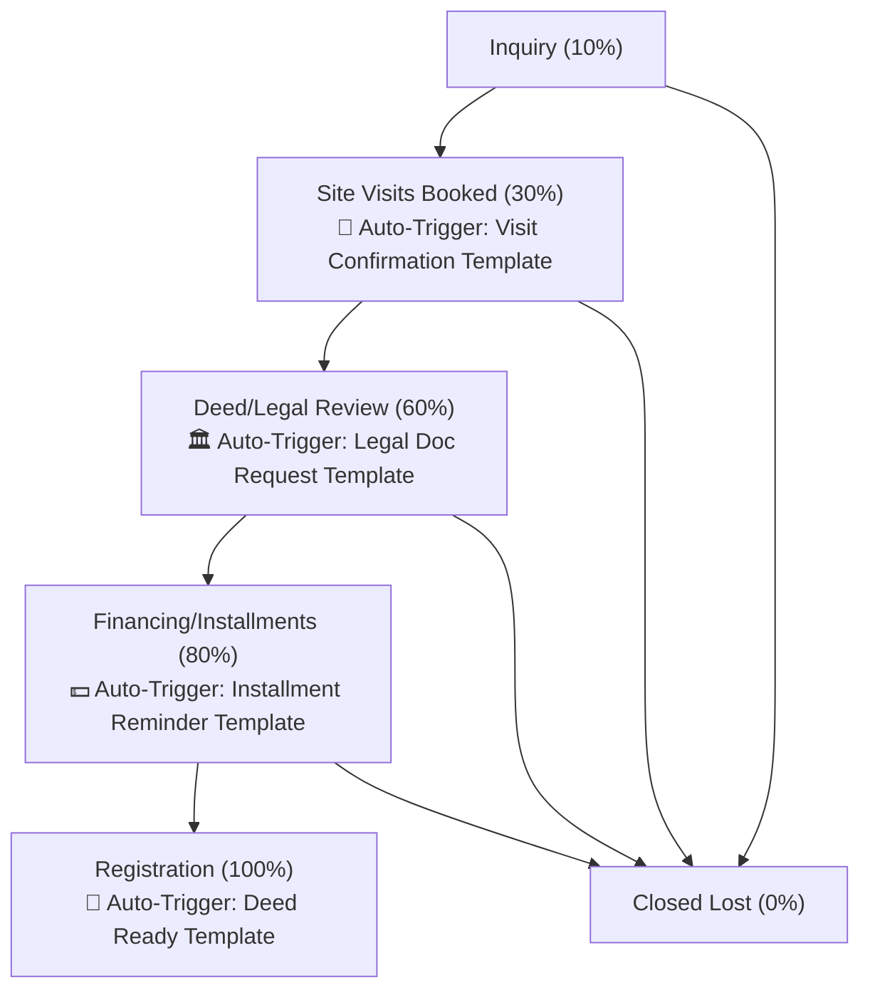
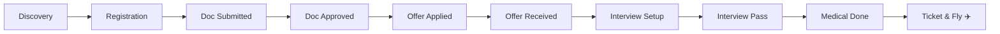
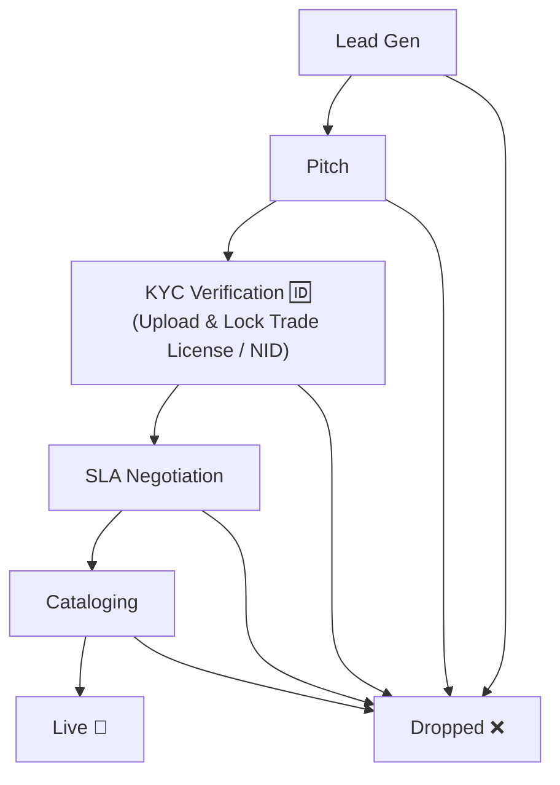
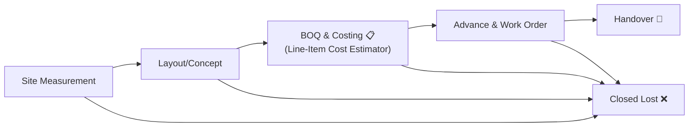

# OKI CRM: Industry Sales Pipelines & Workspaces Documentation

OKI CRM implements a polymorphic workflow engine that dynamically renders distinct user interfaces, stage schemas, and automated actions depending on the organization's type code (`organization_type_code`). 

---

## 🏗️ Pipelines at a Glance

| Industry Pipeline | Primary View Layout | Core Mechanics | Key Automation / Custom Features |
| :--- | :--- | :--- | :--- |
| **Study Abroad** | **Kanban Board** (Drag & Drop) | Traditional multi-column deal board | counselor/admission departments assignment |
| **Real Estate** | **Project Portal** (Drill-Down List) | Projects dashboard & tab filtering | **Automated WhatsApp dispatcher** triggered on stage changes |
| **E-commerce** | **Split-Pane Inspector** (Two-Column) | Left: Merchant List; Right: Stage Chevrons | **Document Lockers** (KYC: NID, Trade License files) |
| **Vendors & Interior**| **Milestone Matrix** (Grid Sheet) | High-density project milestone spreadsheet | **BOQ Line-Item Editor** & supplier payment logger |

---

## 1. 🏠 Real Estate Workspace
Designed for property developers and agents to track plot/apartment bookings, site visits, legal approvals, and registration status.

### 📋 Stages & Probabilities
1. **Inquiry** (10%): Initial prospect interest logged.
2. **Site Visits Booked** (30%): A guided physical property visit is scheduled.
3. **Deed/Legal Review** (60%): Assessment of client NID, tax clearances, and draft deeds.
4. **Financing/Installments** (80%): Payment schedules set up and installment tracker active.
5. **Registration** (100% - Closed/Won): Final handover of deeds and registry documentation.
6. **Closed Lost** (0% - Closed/Lost): Deal dropped.

### ⚙️ How it Works
* **Project Dashboard View**: Deals are grouped by physical development projects (e.g. *"Uttara Apartment"*, *"Gulshan Plot"*). Clicking a project drills down into its specific deals.
* **Stage Tabs & Dropdowns**: Deals list has quick tab filters for stages. You update stages via a dropdown.
* **Stage Change Automation**: Changing the stage immediately pops up a **WhatsApp Dispatcher Modal** (with a responsive, card-based layout). It preloads custom messages replacing variables like `[ProjectName]` dynamically:
  * **Site Visits Booked** triggers *Site Visit Confirmation* ("*Dear Client, your site visit to Gulshan Apartment is scheduled...*").
  * **Deed/Legal Review** triggers *Deed & Legal Document Request*.
  * **Financing/Installments** triggers *Installment Reminder*.
  * **Registration** triggers *Registration Completion Update*.

---

## 2. 🎓 Study Abroad Application Pipeline
Tailored for education agencies helping students with registrations, university applications, offers, visas, and departure logs.

### 📋 Stages & Probabilities
1. **Discovery** (10%): Counselling session and basic profile evaluation.
2. **Registration** (20%): Student signs contract and pays processing fees.
3. **Document Submitted** (30%): Transcripts, passports, and CVs gathered.
4. **Document Approved** (40%): Internal check verifies all docs meet foreign university standards.
5. **Offer Letter Applied** (55%): Application dispatched to target institutions.
6. **Offer Letter Received** (70%): University offers or conditional admissions received.
7. **Interview Scheduled** (75%): Visa or university mock preparation interview booked.
8. **Interview Pass** (85%): Main interview cleared.
9. **Medical Done** (90%): Official health verification certificate submitted.
10. **Ticket & Fly** (100% - Closed/Won): Flight tickets booked; student departs.

### ⚙️ How it Works
* **Classic Kanban Board**: Opportunities are arranged in horizontal columns representing each stage. Cards can be dragged and dropped between columns to change stages.
* **Department Assignment**: Student files can be assigned to different teams (Counselor Dept, Admission Dept) to ensure processing accountability.

---

## 3. 🛍️ E-commerce Merchant Onboarding Pipeline
Designed for commercial teams onboarding digital sellers onto a payment gate, platform marketplace, or logistics service.

### 📋 Stages & Probabilities
1. **Lead Gen** (10%): Raw merchant list import and profiling.
2. **Pitch** (30%): Presentation of transaction terms and commission structure.
3. **KYC Verification** (50%): Legal checks on business entities and owners.
4. **SLA Negotiation** (70%): Finalizing fee percentages and service level contracts.
5. **Cataloging** (90%): Syncing online storefront items and setting up vendor profiles.
6. **Live** (100% - Closed/Won): Merchant starts processing transactions.
7. **Dropped** (0% - Closed/Lost): Seller registration cancelled.

### ⚙️ How it Works
* **Split-Pane Layout**: The UI splits into two sections. The left section lists merchants; selecting one loads the interactive detailed workspace on the right.
* **Stage Chevron Progressions**: Large, clickable top-bar chevrons show the merchant's progression. Clicking *Advance Stage* or *Drop* controls transitions.
* **Document Lockbox**: When in the **KYC Verification** stage, the right inspector unlocks file inputs for *NID* and *Trade License* uploads, storing them in the deal metadata (`industry_data`) with preview options.

---

## 4. 📐 Vendors & Interior Design Project Pipeline
Built for service providers, contracting vendors, and interior designers handling measurements, layout designs, bill-of-quantities (BOQs), and fit-out handovers.

### 📋 Stages & Probabilities
1. **Site Measurement** (20%): Physical parameters, site maps, and photos recorded.
2. **Layout/Concept Design** (40%): Moodboards, 2D floorplans, or 3D renders generated.
3. **BOQ & Costing** (60%): Detailed listing of materials, item units, and labour quotes.
4. **Advance & Work Order** (80%): Client signs off on BOQ and pays mobilization deposits.
5. **Handover** (100% - Closed/Won): Physical inspection and keys delivery.
6. **Closed Lost** (0% - Closed/Lost): Project bid rejected.

### ⚙️ How it Works
* **Spreadsheet Grid Matrix**: The main dashboard is structured as a high-density, horizontal spreadsheet layout mapping projects to milestone status cells. This allows PMs to review overall site phases in a single look.
* **Cost Estimator & BOQ Drawer**: Clicking a project opens a right panel to configure the Bill of Quantities. You can add items (Description, Quantity, Unit Price, Supplier Cost) to automatically sum total values, profit margins, and record payments.

---

> [!NOTE]
> Pipelines are seeded into the database dynamically on organization initialization. The active pipeline is determined by retrieving `/api/v1/organizations/me` from the database.
